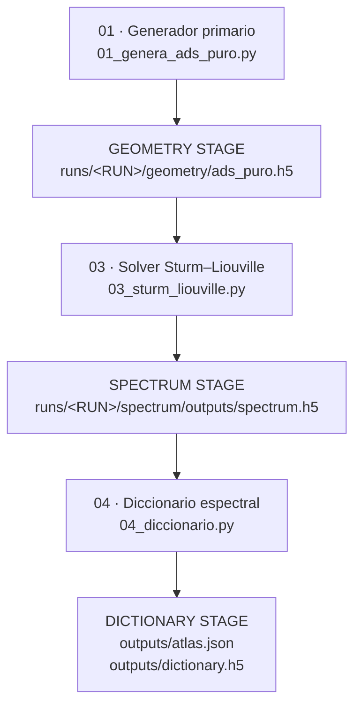

# BASURIN – Pipeline mínimo (v1)

> **Estado:** canónico, prescriptivo y auditado hasta la etapa de diccionario.
>
> **Alcance:** desde generadores primarios (01) hasta diccionario espectral (04).
> Todo lo posterior (tangentes, bridge, contratos avanzados) queda fuera de este documento.

---

## 0. Principio rector (no negociable)

> **Ningún script puede consumir un artefacto que no haya sido producido explícitamente por una etapa anterior del pipeline.**

Consecuencias operativas:
- Si un artefacto no existe bajo `runs/<RUN>/`, **no existe**.
- Si un mismo artefacto aparece en dos rutas distintas, el pipeline está **roto**.
- Si una etapa no deja artefactos verificables (`outputs/`, `manifest.json`, `stage_summary.json`), esa etapa **no existe**.

---

## 1. Estructura canónica de un RUN

Todo run vive bajo:

```
runs/<RUN>/
```

Cada etapa propietaria de datos crea **exactamente**:

```
runs/<RUN>/<stage>/
├── outputs/
│   └── <artefactos>.*
├── manifest.json
└── stage_summary.json
```

**Regla:** no se permiten artefactos fuera de `outputs/`.

---

## 2. Etapa 01 — Generadores primarios

### Definición
Un script `01_*` es un generador primario si y solo si:
- **no requiere ningún run previo**
- crea datos físicos iniciales
- **no consume** `spectrum.h5`

Los 01 definen el **origen causal** del pipeline.

### Scripts existentes

#### `01_genera_ads_puro.py`

**Rol:** generador de geometría AdS pura.

**Entrada:**
- parámetros geométricos (`z`, `d`, `L`, etc.)

**Salida:**
```
runs/<RUN>/geometry/
└── ads_puro.h5
```

**Contenido del HDF5:**
- coordenada radial
- factores métricos
- *no contiene espectro*

**Nota importante:**
Este script **NO** genera `spectrum.h5`. Esto es correcto: el espectro no es un objeto primario, deriva de la geometría.

---

#### `01_genera_neutrino_sandbox.py`

**Rol:** generador sintético (sandbox).

**Estado:** no auditado en este documento, pero conceptualmente equivalente a un 01:
- no depende de runs previos
- crea datos iniciales

---

### Regla de la etapa 01

Los generadores **no producen espectro** salvo que el espectro sea el objeto físico primario del modelo. En BASURIN, **no lo es**.

---

## 3. Etapa 03 — Solver espectral (Sturm–Liouville)

### Definición
La etapa 03 es la **única responsable** de crear el espectro.

### Script
`03_sturm_liouville.py`

### Entrada
- geometría producida por un 01:
```
runs/<RUN>/geometry/*.h5
```

### Salida canónica (obligatoria)
```
runs/<RUN>/spectrum/
├── outputs/
│   └── spectrum.h5
├── manifest.json
└── stage_summary.json
```

### Contenido obligatorio de `spectrum.h5`
El archivo debe contener:
- `delta_uv` : array 1D
- `masses` **o** `M2` : array 2D (N × n_modes)

Si alguno de estos datasets falta, el pipeline se considera **inválido**.

### Nota operativa importante
`03_sturm_liouville.py` ancla el argumento `--geometry-file` al directorio:
```
runs/<RUN>/geometry/
```
Por tanto:
- `--geometry-file ads_puro.h5` ✔
- `--geometry-file runs/<RUN>/geometry/ads_puro.h5` ✘ (duplica ruta)

Esto debe respetarse o corregirse explícitamente en el código.

---

## 4. Convención única de rutas del espectro

### Ruta canónica (única válida para nuevos runs)
```
runs/<RUN>/spectrum/outputs/spectrum.h5
```

### Ruta legacy (solo lectura, compatibilidad)
```
runs/<RUN>/spectrum/spectrum.h5
```

### Resolución de rutas
Todo consumidor del espectro **debe** usar un resolver centralizado:

```python
resolve_spectrum_path(run_dir)
```

Está prohibido:
- hardcodear rutas
- asumir existencia del espectro
- copiar archivos manualmente entre runs

Si el espectro no existe, la ejecución debe **abortar** con un error claro:
> “Falta etapa spectrum (03).”

---

## 5. Etapa 04 — Diccionario espectral

### Script
`04_diccionario.py`

### Entrada
- `runs/<RUN>/spectrum/outputs/spectrum.h5`

### Salida
```
runs/<RUN>/dictionary/
├── outputs/
│   ├── dictionary.h5
│   └── atlas.json
├── manifest.json
└── stage_summary.json
```

### Función
- Aprende el mapeo espectro → Δ
- Construye un atlas interno de teorías efectivas
- Verifica consistencia mínima (C2)

### Condición de éxito
La ejecución debe imprimir:
```
[OK] VERIFICADO: Diccionario consistente
```

Si falla aquí, **todo lo anterior está mal**.

---

## 6. Estado verificado del pipeline

✔ `01_genera_ads_puro.py` genera geometría
✔ `03_sturm_liouville.py` genera espectro cuando se usa correctamente
✔ `04_diccionario.py` funciona con espectro válido

✘ No existe un runner formal del pipeline
✘ No existía documentación explícita conectando 01 → 03 → 04
✘ La numeración histórica inducía a error (mezcladores como 01)

---

## 7. Decisiones arquitectónicas fijadas

A partir de este documento:

1. **01 = generador primario**
2. **02 = transformaciones / mezclas**
3. **03 = productor exclusivo del espectro**
4. **04 = diccionario**
5. Ninguna etapa posterior se ejecuta si falta una anterior
6. El espectro **solo existe** en `spectrum/outputs/`

---

## 8. Recomendación explícita

Si se decide reconstruir el proyecto desde cero:

- Conservar únicamente:
  - `01_genera_ads_puro.py`
  - `03_sturm_liouville.py`
  - `04_diccionario.py`
  - resolución centralizada de rutas (`basurin_io.py` / `io_paths.py`)
- Archivar o eliminar el resto
- Reescribir etapas posteriores solo cuando este pipeline esté estabilizado

Este documento constituye el **contrato mínimo** del pipeline BASURIN v1.

## 9. Esquema





